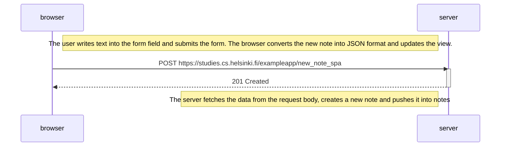

```mermaid
sequenceDiagram
    participant browser
    participant server
    
    Note right of browser: The user writes text into the form field and submits the form. The browser converts the new note into JSON format and updates the view.
    
    browser->>server: POST https://studies.cs.helsinki.fi/exampleapp/new_note_spa
    activate server
    server-->>browser: 201 Created
    deactivate server

    Note left of server: The server fetches the data from the request body, creates a new note and pushes it into notes
```